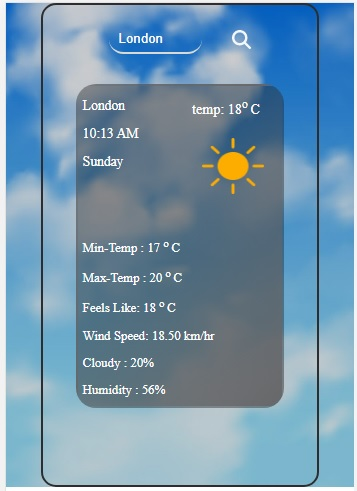

# Responsive-Weather-Forecast

My responsive weather forecast website! Stay up-to-date with the latest weather conditions and plan your day accordingly. this website offers a seamless experience across all devices, ensuring you have access to accurate and reliable weather information wherever you are.

#### The visuals of the website automatically changes according to the live time and weather conditions.

# This website shows following parameters based on user Input:

- live Temperature
- live time in 12 hour format
- Week Day (Example - sunday,monday,....)
- City Name
- Wind speed
- Cloud perencentage
- Temperature Feels Like
- Minimum Temperature
- Maximum Temperature
- Humidity

# Technologies Used

- HTML
- CSS
- Javascript

## Screenshots

